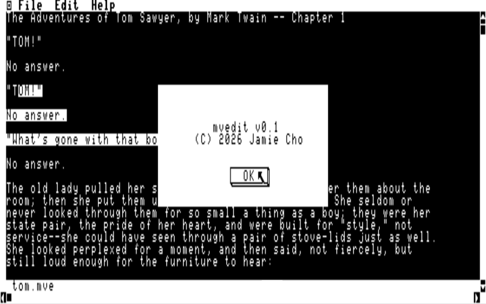

# mvedit

A mouse-driven **text editor** for the Tandy Color Computer 3 under Multi-Vue
(NitrOS-9 Level 2), built with MVKit. It is the editor companion to
[mvdraw](https://github.com/jamieleecho/mvdraw): same toolchain, same app
skeleton (theme, menu bar, document model, content view), but the content view
is an editable text area instead of a vector canvas.

It runs in a framed window **with scroll bars** (cgfx `WT_FSWIN`). The window is
80×25 characters; the window chrome (frame + scroll bars) leaves a **78×23**
working area, of which the bottom row is a status line, so text occupies 78×22
cells. Lines may be up to **127** characters long; the view scrolls horizontally
and vertically to reach the rest.



## Features

- **Mouse:** click to place the cursor; click-drag to select a range (selection
  is shown in reverse video). Dragging to an edge auto-scrolls.
- **Scroll bars:** the `WT_FSWIN` scroll arrows scroll the text; the thumbs
  track the view position.
- **File:** New, Open…, Save, Save As…, Exit. Documents default to the `.txt`
  extension and use the OS-9 carriage-return (`$0D`) line convention. A dirty
  document prompts to save before New / Open / close.
- **Edit:** Undo (single level), Cut, Copy, Paste, Delete, Select All, backed by
  an internal clipboard.
- **Keyboard:** type to insert; Enter splits a line; the erase key removes the
  character before the cursor; the arrow keys move the cursor (Up/Down/Right —
  left is done with the mouse, since the CoCo shares one code for left/erase).
- **Status line:** file name, a dirty marker, and the cursor line/column.

### Keyboard shortcuts

- **File** — `Ctrl-N` New, `Ctrl-O` Open, `Ctrl-S` Save
- **Edit** — `Ctrl-Z` Undo, `Ctrl-X` Cut, `Ctrl-C` Copy, `Ctrl-V` Paste,
  `Ctrl-A` Select All

## Building

All builds run inside the `jamieleecho/coco-dev` Docker toolchain image. The
top-level `Makefile` bootstraps everything (clones + builds `cmoc_os9`, installs
the vendored MVKit) on the first run.

```sh
./coco-dev make && make    # -> build/mvedit.os9   (first run is slow)
./coco-dev make real-clean
```

`./coco-dev` opens an interactive shell; for non-interactive/CI use run docker
directly (no TTY):

```sh
docker run --rm -v /Users:/home -e HOME=/home/$USER \
  -w "/home/$(pwd | sed 's#^/Users/##')" jamieleecho/coco-dev:latest make
```

## Running

```sh
make run                   # launches build/mvedit.os9 in MAME (host, needs a display)
```

In the CoCo 3 window: after Multi-Vue loads, open the `/dd` drive and
double-click the **mvedit** icon. You can also pass a file to open on the
command line (`mvedit somefile.txt`).

## Regenerating art

The launcher icon and the palettes are generated:

```sh
python3 tools/gen_assets.py     # writes assets/app-icon.png + the palettes
```

## Layout

| Path | What |
|------|------|
| `mvedit.c` | app: theme, menus, document/file lifecycle, undo, event wiring |
| `textdoc.c` / `.h` | the document model (lines) + save/load + editing primitives |
| `text_view.c` / `.h` | the editable text view (render, cursor, selection, scroll, clipboard) |
| `tools/gen_assets.py` | PIL generator for the launcher icon + palettes |
| `mvkit/` | the MVKit framework (vendored at build time) |
| `disks/` | the NitrOS-9 base disk image |
